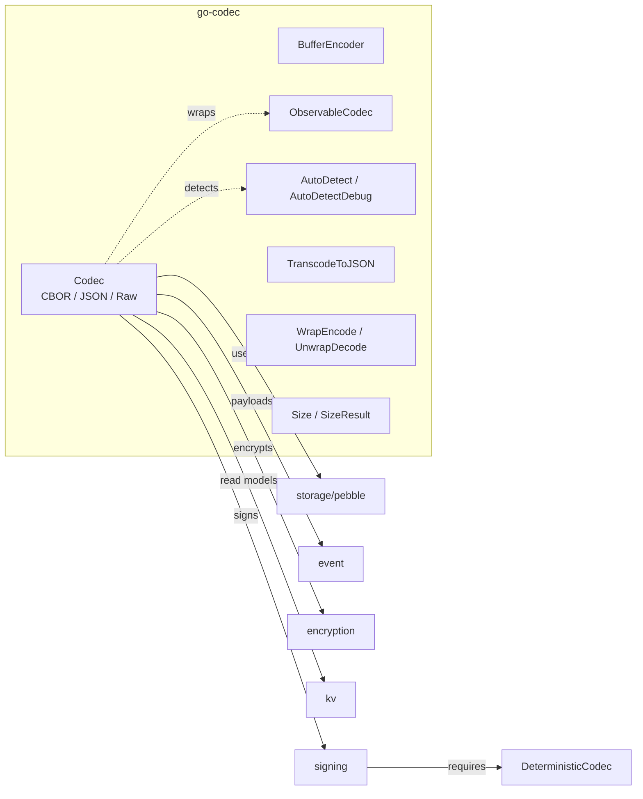

# go-codec — Payload Encoding (CBOR / JSON / Raw)

[](https://pkg.go.dev/github.com/larsartmann/go-codec)

Encoding/decoding for event-sourced payloads. Provides the `Codec` interface used by stores, snapshots, and event construction.

```bash
go get github.com/larsartmann/go-codec
```

## Architecture

go-codec is the serialization contract at the center of an event-sourcing/CQRS stack.
The `Codec` interface is consumed by storage, event construction, signing, and
encryption modules:



- `Codec` / `BufferEncoder` — payload serialization and the zero-allocation hot path.
- `ObservableCodec` — metrics, hooks, and monitoring without changing the codec.
- `AutoDetectDebug` — best-effort encoding inference for mixed-format streams.
- `TranscodeToJSON` / `WrapEncode` / `Size` — format conversion, self-describing
  envelopes, and payload-size diagnostics.
- Sibling modules in `go-cqrs-lite` consume the contract; the signing module can assert
  `DeterministicCodec` to reject non-deterministic codecs at compile time.

## Codecs

| Codec              | Description                                                              |
| ------------------ | ------------------------------------------------------------------------ |
| `CBORCodec`        | **Recommended.** Canonical CBOR (RFC 7049) — deterministic, signing-safe |
| `JSONCodec`        | Standard `encoding/json` — universal interop, human-readable             |
| `CBORCompactCodec` | Stricter CBOR (RFC 8949 Core Deterministic) + unknown-field rejection    |
| `RawCodec`         | Passthrough for pre-encoded `[]byte` payloads                            |

## Interface

```go
type Codec interface {
    Encoding() Encoding
    Encode(v any) ([]byte, error)
    Decode(data []byte, v any) error
}

// Optional zero-allocation interface:
type BufferEncoder interface {
    EncodeToBuffer(v any, buf *bytes.Buffer) error
}
```

## Usage

### CBOR (Canonical) — Recommended

```go
codec := codec.CBORCodec{}
data, _ := codec.Encode(MyPayload{Name: "Alice"})
var decoded MyPayload
_ = codec.Decode(data, &decoded)
```

CBOR produces deterministic output (sorted map keys, shortest floats), making it
safe for content-addressed storage and cryptographic signing. The pebble event
store uses CBOR internally for its on-disk envelope format.

### JSON

```go
codec := codec.JSONCodec{}
data, _ := codec.Encode(MyPayload{Name: "Alice"})
var decoded MyPayload
_ = codec.Decode(data, &decoded)
```

### CBOR Compact (Strict)

```go
codec := codec.CBORCompactCodec{}
data, _ := codec.Encode(MyPayload{Name: "Alice"})
```

`CBORCompactCodec` uses stricter settings than `CBORCodec`:

- **Encoding**: Core Deterministic (RFC 8949) — bytewise-lexically sorted map keys
- **Decoding**: Rejects unknown struct fields as schema drift detection

**Not compatible** with data written by `CBORCodec`. Use only for new event stores.

### CBOR with Event Signing

CBOR's deterministic encoding makes it ideal for signed event payloads — the same
data always produces the same bytes, so signatures are reproducible:

```go
// Use CBOR for deterministic event payloads
c := codec.CBORCodec{}
data, _ := c.Encode(payload)

// Sign the canonical CBOR bytes (same input → same signature every time)
signer, _ := signing.NewHMAC(secret)
sig, _ := signer.Sign(data)

// Verify on the consumer side
if !signer.Verify(data, sig) {
    return errors.New("signature mismatch")
}
var decoded MyPayload
_ = c.Decode(data, &decoded)
```

For compile-time safety, the signing module should accept
[`codec.DeterministicCodec`](https://pkg.go.dev/github.com/larsartmann/go-codec#DeterministicCodec)
instead of a plain `codec.Codec`. Only `CBORCodec`, `CBORCompactCodec`, and (in the
opt-in v2 JSON build) `JSONCodec` satisfy this interface, turning accidental use of
non-deterministic v1 JSON into a build error.

### When to Use CBOR vs JSON

**CBOR is the recommended default** for internal serialization — it produces
smaller payloads and faster encode/decode times than JSON (run
`BenchmarkTagTradeoffs_Encode`/`BenchmarkTagTradeoffs_Decode` and
`BenchmarkRealisticPayload_Encode` for measured numbers on your hardware).
CBOR is also deterministic: the same input always produces the same bytes,
making it safe for signing. JSON is fully supported and remains the right
choice for external interop, debugging, and human-readable payloads. Both
codecs work everywhere in the library; pick one per use case.

| Scenario                                | Recommended Codec  | Why                                 |
| --------------------------------------- | ------------------ | ----------------------------------- |
| **Default for new projects**            | `CBORCodec`        | Smaller, faster, signing-safe       |
| Event payloads in PebbleDB              | `CBORCodec`        | Deterministic encoding for signing  |
| Cryptographic signing of payloads       | `CBORCodec`        | Canonical byte representation       |
| High-throughput event streams           | `CBORCodec`        | Smaller encoded size, faster decode |
| Read models / projections               | `CBORCodec`        | Smaller, faster, deterministic |
| New event store with schema drift guard | `CBORCompactCodec` | Unknown-field rejection on decode   |
| External system interop / HTTP APIs     | `JSONCodec`        | Universal support                   |
| Debugging / human-readable payloads     | `JSONCodec`        | Readable in logs, curl, DB queries  |
| Pre-encoded payloads                    | `RawCodec`         | Zero-copy passthrough               |

## CBOR Struct Tags for Smaller Payloads

fxamacker/cbor reads `json` struct tags by default, so CBOR works with existing
struct definitions. For additional payload size reduction, use CBOR-specific tags:

### `toarray` — Positional Array Encoding (~30-40% smaller)

Encodes structs as positional CBOR arrays instead of keyed maps, eliminating
field-name string overhead entirely:

```go
type UserCreated struct {
    _     struct{} `cbor:",toarray"`
    Name  string
    Email string
    Time  int64
}
```

Without toarray: `{"Name":"Alice","Email":"a@b.com","Time":1700000000}`
With toarray: `["Alice","a@b.com",1700000000]`

Once a struct uses `toarray`, field **order is part of the wire format** and cannot
be reordered without breaking existing data. Add new fields only at the end.

### `keyasint` — Integer Field Keys

```go
type OrderPlaced struct {
    _      struct{} `cbor:",keyasint"`
    UserID uint64   `cbor:"1,keyasint"`
    ItemID uint64   `cbor:"2,keyasint"`
    Qty    int      `cbor:"3,keyasint"`
}
```

### `omitzero` — Skip Zero-Valued Fields

```go
type UserUpdated struct {
    Name  string `cbor:"name"`
    Email string `cbor:"email,omitempty"`
    Bio   string `cbor:"bio,omitzero"`
}
```

Both tags work with `CBORCodec` and `CBORCompactCodec`. Once adopted, the
integer key mapping is part of the wire format — changing key numbers breaks
existing data.

## Zero-Allocation Encoding (BufferEncoder)

Codecs that implement the `BufferEncoder` interface can write directly into a
caller-provided `bytes.Buffer`, avoiding the allocation returned by `Encode`:

```go
buf := &bytes.Buffer{}
if be, ok := codec.(codec.BufferEncoder); ok {
    _ = be.EncodeToBuffer(payload, buf)
}
```

Both `JSONCodec`, `CBORCodec`, and `CBORCompactCodec` implement `BufferEncoder`.

## Pooled Encoding (`EncodePooled`)

For hot paths that encode and immediately process the bytes (e.g., writing to a
store or sending over the wire), `EncodePooled` manages the
`GetBuffer` / `EncodeToBuffer` / `PutBuffer` lifecycle for you:

```go
err := codec.EncodePooled(codec.CBORCodec{}, event, func(data []byte) error {
    // data is valid only inside this callback — copy it if you need to keep it.
    _, err := store.Write(data)
    return err
})
```

Compared to `Encode`, this eliminates the per-call `[]byte` allocation. If the
caller needs to retain the encoded bytes, use `Encode` instead (or `append` a copy
inside the callback).

## Streaming CBOR

For encoding/decoding large event batches without materializing the full byte
slice in memory, use the streaming encoder/decoder:

```go
// Encode a batch to a stream
f, _ := os.Create("events.cbor")
enc := codec.NewCBOREncoder(f)
for _, evt := range events {
    _ = enc.Encode(evt)
}

// Decode a batch from a stream
f, _ := os.Open("events.cbor")
dec := codec.NewCBORDecoder(f)
for {
    var evt MyEvent
    if err := dec.Decode(&evt); err == io.EOF { break }
}
```

The streaming encoder uses the same canonical encoding mode as `CBORCodec`.

## Streaming JSON (NDJSON)

For JSON-based streams, `NewJSONEncoder` and `NewJSONDecoder` write and read
newline-delimited JSON (NDJSON / JSON Lines). Each `Encode` call writes one JSON
value followed by a newline, so readers can consume values incrementally without
waiting for the whole stream:

```go
// Encode a batch as NDJSON
var buf bytes.Buffer
enc := codec.NewJSONEncoder(&buf)
for _, evt := range events {
    _ = enc.Encode(evt)
}

// Decode values one at a time
dec := codec.NewJSONDecoder(&buf)
for {
    var evt MyEvent
    if err := dec.Decode(&evt); err != nil {
        break // io.EOF or end of stream
    }
}
```

The NDJSON format is convenient for logs, SSE, and HTTP line-streaming. The v2
JSON build uses `json.MarshalWrite` per value rather than a streaming encoder
with separator tokens, keeping the output byte-identical to NDJSON.

## CBOR Diagnostic Notation

Debug corrupt events or inspect raw CBOR payloads in human-readable form:

```go
cborData, _ := codec.CBORCodec{}.Encode(event)
diag, _ := codec.Diagnose(cborData)
log.Printf("CBOR event: %s", diag)
```

## Size Comparison (`Size` / `SizeResult`)

Use `Size` to compare the JSON and CBOR byte sizes of a value before committing to a
format change. It returns a `SizeResult` with `JSON` and `CBOR` fields:

```go
s := codec.Size(UserCreated{Name: "Alice", Email: "a@b.c"})
fmt.Printf("json=%d cbor=%d savings=%.0f%%\n",
    s.JSON, s.CBOR,
    float64(s.JSON-s.CBOR)/float64(s.JSON)*100)
```

If a codec cannot encode the value, that field is reported as `-1`. This is useful
for payload-size budgets and for justifying a switch from JSON to CBOR on
size-critical event types.

## Telemetry (`ObservableCodec`)

Wrap any codec with `ObserveCodec` to record per-operation metrics — call
counts, byte totals, error counts, and last errors — without touching the
underlying codec. The wrapper is goroutine-safe and preserves the optional
`BufferEncoder` fast path when the wrapped codec implements it.

```go
obs := codec.ObserveCodec(codec.CBORCodec{},
    codec.WithMetricsHook(func(op codec.Operation, enc codec.Encoding, bytes int, err error) {
        // Push-style telemetry: emit to Prometheus, OpenTelemetry, or logs.
    }),
)

data, _ := obs.Encode(payload)

m := obs.Metrics().Snapshot() // m.EncodeCalls, m.EncodeBytes, m.EncodeErrors, ...
```

- **`WithMetrics(shared)`** — share one `CodecMetrics` sink across multiple codecs.
- **`Snapshot()` / `Reset()`** — point-in-time copy vs. clear counters.
- **Panic policy:** hook panics propagate (not recovered); metrics are recorded
  before the hook runs, so counters stay consistent.

See [`ExampleMetricsHook`](https://pkg.go.dev/github.com/larsartmann/go-codec#ExampleMetricsHook)
for a dependency-free counter implementation. In production, replace the map
with Prometheus, OpenTelemetry, or structured log emission inside the hook.

## Explainable Format Detection (`AutoDetectDebug`)

`AutoDetect` returns just the encoding; `AutoDetectDebug` also explains *why*:

```go
result := codec.AutoDetectDebug(payload)
log.Printf("detected %s: %s", result.Encoding, result.Detail)

switch result.Reason { // branch on Reason — it is the stable contract
case codec.DetectionReasonCBORMajorType, codec.DetectionReasonCBORTrialDecode:
    // handle CBOR
case codec.DetectionReasonJSONStructure, codec.DetectionReasonJSONTrialDecode:
    // handle JSON
}
```

`Reason` is stable and machine-readable. `Detail` is human-readable prose for
logs and triage — its wording may change between releases, so never parse it.

## Shared CBOR Modes

Modules that need CBOR encoding identical to `CBORCodec` (e.g., custom storage
backends) should use the exported modes instead of creating their own:

```go
// Same canonical EncMode/DecMode used by CBORCodec internally
data, _ := codec.CBOREncMode().Marshal(payload)
_ = codec.CBORDecMode().Unmarshal(data, &payload)
```

## Time Handling

CBOR codecs use `TimeUnixDynamic` — float64 epoch with sub-second precision (9 bytes).
This preserves nanosecond values in `time.Time` payload fields (within ~165ns float drift).

**Convention:** All `time.Time` in event payloads MUST be `.UTC()` before encoding.
Epoch values carry no timezone; decoded times reconstruct in `time.Local`, not the
original location. Normalizing to UTC at encode time eliminates this ambiguity.

**Wall-clock times** (recurring schedules, business hours) must NOT use `time.Time` —
store wall time components + IANA timezone name instead.

## CBOR → JSON Transcoding (`TranscodeToJSON`)

Schema-free bridge for consumers that store events in CBOR but must serve JSON
to browsers or REST clients (e.g. SSE delivery). Decodes the CBOR data model
into a generic Go value and re-encodes as JSON, without needing the original
struct type:

```go
// payload is the stamped event payload; enc comes from evt.Encoding()
jsonBytes, err := codec.TranscodeToJSON(payload, enc)
```

- `EncodingJSON` / `EncodingRaw`: returned **unchanged** (zero-cost passthrough).
- `EncodingCBOR`: decoded generically and re-encoded as JSON.

Because it is schema-free, CBOR maps become JSON objects and CBOR arrays —
including structs encoded with the `cbor:",toarray"` tag — stay arrays (field
names cannot be reconstructed). For schema-aware JSON output, use
`event.DecodePayloadAuto[T]` with the concrete payload type.

The `transport/http` package (from the sibling CQRS stack) provides
`CBORToJSONTransform`, a ready-made adapter that wraps `TranscodeToJSON` for
`http.WithPayloadTransform` — including graceful fallback to the raw payload on
decode failure, so SSE clients always receive data.

## Dual JSON Support (v1 and v2)

go-codec supports both `encoding/json` (v1, the default) and `encoding/json/v2`
(opt-in). The library uses the [go-branded-id dual-build pattern](https://github.com/larsartmann/go-branded-id):
build-tagged compat files select the JSON implementation at compile time.

**Default (v1):** `go build ./...` — uses `encoding/json`, works on Go 1.26.5+.

**Opt-in (v2):** `GOEXPERIMENT=jsonv2 go build ./...` — uses `encoding/json/v2`
(Go 1.25+ with the experiment flag, or Go 1.27+ natively).

Both modes are fully tested. Choose v2 if you need `json.Deterministic`,
`MarshalWrite`, or other v2-specific features; otherwise v1 is the zero-config
default.

## Related Modules

This codec is part of an event-sourcing/CQRS stack. The sibling modules live in
[go-cqrs-lite](https://github.com/larsartmann/go-cqrs-lite):

- **event** — `DecodePayload[T]` accepts a `Codec` to decode payloads
- **signing** — CBOR's deterministic encoding makes signatures reproducible
- **encryption** — `encryption.NewCodec` wraps a codec with encryption
- **storage/pebble** — Uses CBOR internally for its on-disk envelope format
- **kv** — `WithTypedCodec` lets read models use CBOR
