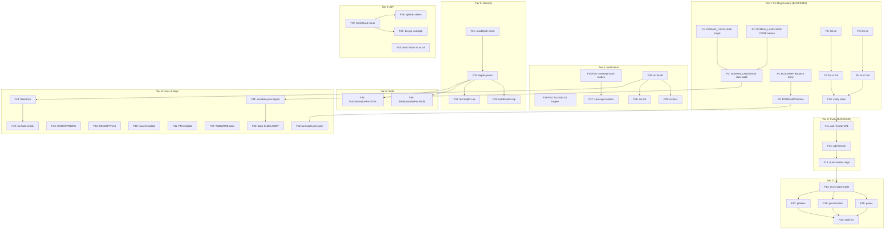

# Plan: go-codec Post-v0.1.0 Hardening & Composable-SDK Completion

> **Created:** 2026-08-12 09:07 CEST
> **Input:** The 50-item next-step list from
> `docs/status/2026-08-12_03-24_composable-sdk-execution-review.md`.
> **Context:** v0.1.0 is tagged locally (not pushed — no remote configured).
> Three regressions from the last session must be fixed before anything else:
> stale DOMAIN_LANGUAGE/ROADMAP (split-brain), unverified lint, no push.

---

## The 1% that delivers 51%

**Fix the three regressions I introduced.** These are self-inflicted wounds on a
tagged release — they block trust in everything else.

1. Fix `docs/DOMAIN_LANGUAGE.md` — wrong `envelopeMagic` value, wrong COSE names, missing dual-build entries
2. Fix `ROADMAP.md` — mark dispatch-table idea as partially done, reflect delivered dual-build
3. Run `golangci-lint` in both modes, fix findings, confirm clean baseline

## The 4% that delivers 64%

**Make the release reachable.** The above + push to GitHub + CI.

4. Resolve the git remote (ask user — blocking question from status report)
5. Push commits + `v0.1.0` tag to remote
6. Add `.github/workflows/ci.yml` (dual-mode build/test/lint/race)

## The 20% that delivers 80%

**Make it trustworthy.** The above + verification gaps + the high-value API polish.

7. Run fuzz targets (60s each) to exercise `normalizeForJSON`
8. Generate coverage report in both modes
9. Verify `flake.nix` actually works (`nix build`, `nix run .#test`)
10. Add depth/size caps to `AutoDetect` + `TranscodeToJSON`
11. Add dedicated `TestNormalizeForJSON` + fuzz target for the normalizer

## The remaining 20% for 100%

12. API: `SizeResult` struct, `TranscodeToCBOR`, `sync.Pool` helper
13. Docs polish: TIMEZONE_HANDLING, CODEOWNERS, security.md, issue templates
14. Perf: benchmark v1 vs v2, benchmark normalizeForJSON
15. Annotate prior status reports + plan (docs-health ANNOTATE)
16. Website launch, schema-evolution tooling, custom-codec registration

---

## Step 2: Comprehensive Plan (Medium Granularity — 30 to 100 min each)

| #   | Task                                                            | Impact | Effort  | Deps     | Category        |
| --- | --------------------------------------------------------------- | ------ | ------- | -------- | --------------- |
| M1  | Fix DOMAIN_LANGUAGE.md split-brain (envelopeMagic, COSE names, dual-build entries) | Exist | 15min | —        | Regression      |
| M2  | Update ROADMAP.md (dispatch-table done, dual-build delivered)   | Exist  | 10min   | —        | Regression      |
| M3  | Run `golangci-lint run ./...` + `--build-tags goexperiment.jsonv2`, fix all findings | Exist | 30min | —        | Regression      |
| M4  | Resolve git remote with user, push commits + v0.1.0 tag         | Exist  | 10min   | —        | Release         |
| M5  | Add `.github/workflows/ci.yml` — dual-mode build/test/lint/race | High   | 45min   | M4       | CI              |
| M6  | Add `gosec` + `govulncheck` + `gitleaks` to CI                  | Med    | 20min   | M5       | CI              |
| M7  | Run fuzz targets 60s each (v1 + v2), document results           | High   | 30min   | —        | Verify          |
| M8  | Generate coverage report both modes, add to FEATURES/README     | Med    | 20min   | —        | Verify          |
| M9  | Verify flake.nix works: `nix build`, `nix run .#test`            | High   | 20min   | —        | Verify          |
| M10 | Add depth cap to `normalizeForJSON` (prevent stack overflow on adversarial CBOR) | High | 20min | —    | Security        |
| M11 | Add depth cap to `AutoDetect` trial-decode path                 | Med    | 15min   | —        | Security        |
| M12 | Add `TestNormalizeForJSON` (table-driven, edge cases)           | Med    | 20min   | M10      | Tests           |
| M13 | Add `FuzzNormalizeForJSON` fuzz target                          | Med    | 15min   | M10      | Tests           |
| M14 | `Size` → `SizeResult{JSON, CBOR int}` struct return             | Low    | 30min   | —        | API             |
| M15 | Add `TranscodeToCBOR` (symmetric) or rename to one-way contract | Low    | 45min   | —        | API             |
| M16 | Add `sync.Pool[*bytes.Buffer]` helper for BufferEncoder         | Low    | 30min   | —        | Perf            |
| M17 | Benchmark v1 vs v2 JSON paths + `normalizeForJSON` allocation   | Low    | 30min   | —        | Perf            |
| M18 | Update prior status report + plan annotations (docs-health ANNOTATE) | Low | 20min | M1-M3 | Docs         |
| M19 | Add `docs/TIMEZONE_HANDLING.md` or drop README reference        | Low    | 20min   | —        | Docs            |
| M20 | Add `CODEOWNERS`, `SECURITY.md`, issue/PR templates             | Low    | 20min   | —        | Repo            |
| M21 | Add `flake.lock` + `nix flake check` validation                 | Med    | 15min   | M9       | Repo            |
| M22 | Re-run docs-health AUDIT to confirm no split brains remain      | Med    | 30min   | M1-M3    | Docs            |

**Total estimated effort: ~9 hours**

---

## Step 3: Detailed Breakdown (Fine Granularity — max 12 min each)

### Tier 1: Fix Regressions (BLOCKING — I introduced these)

| #   | Task                                                        | Est  | Deps   |
| --- | ----------------------------------------------------------- | ---- | ------ |
| F1  | Fix DOMAIN_LANGUAGE: `envelopeMagic` "cqrs" → "gcdc"       | 2min | —      |
| F2  | Fix DOMAIN_LANGUAGE: rename COSE*String → COSE*Diagnostic   | 3min | —      |
| F3  | Add DOMAIN_LANGUAGE entries: dual-build, normalizeForJSON, rawJSONValue | 8min | —   |
| F4  | Update ROADMAP: mark dispatch-table as partially delivered  | 5min | —      |
| F5  | Update ROADMAP: note dual-build as delivered, update themes | 5min | —      |
| F6  | Run `golangci-lint run ./...` (v1 mode), capture findings   | 5min | —      |
| F7  | Fix any v1 lint findings                                    | 10min| F6     |
| F8  | Run `golangci-lint run --build-tags goexperiment.jsonv2`    | 5min | —      |
| F9  | Fix any v2 lint findings                                    | 10min| F8     |
| F10 | Verify: both lint modes clean, both test modes green        | 3min | F7,F9  |

### Tier 2: Release Reachability (BLOCKING — user asked to push)

| #   | Task                                                        | Est  | Deps   |
| --- | ----------------------------------------------------------- | ---- | ------ |
| F11 | Ask user for git remote URL (cannot resolve myself)         | 1min | —      |
| F12 | `git remote add origin <url>`                               | 1min | F11    |
| F13 | `git push -u origin master --tags`                          | 2min | F1-F12 |

### Tier 3: CI

| #   | Task                                                        | Est  | Deps   |
| --- | ----------------------------------------------------------- | ---- | ------ |
| F14 | Create `.github/workflows/ci.yml` — matrix: Go 1.26, JSON v1+v2 | 30min | F13 |
| F15 | Add `gosec` step to CI                                      | 5min | F14    |
| F16 | Add `govulncheck` step to CI                                | 5min | F14    |
| F17 | Add `gitleaks` step to CI                                   | 5min | F14    |
| F18 | Verify CI triggers on push                                  | 5min | F14-F17|

### Tier 4: Verification Gaps

| #   | Task                                                        | Est  | Deps   |
| --- | ----------------------------------------------------------- | ---- | ------ |
| F19 | Run `FuzzCBORCodec_Roundtrip` 60s (v1 mode)                 | 5min | —      |
| F20 | Run `FuzzCBORCodec_Roundtrip` 60s (v2 mode)                 | 5min | —      |
| F21 | Run `FuzzTranscodeToJSON` 60s (v1 mode — exercises normalize) | 5min | —    |
| F22 | Run `FuzzTranscodeToJSON` 60s (v2 mode)                     | 5min | —      |
| F23 | Run `FuzzCBORCodec_Determinism` 60s (v1)                    | 5min | —      |
| F24 | Run `FuzzCBORCodec_Determinism` 60s (v2)                    | 5min | —      |
| F25 | Generate coverage: `go test ./... -coverprofile` (v1)       | 5min | —      |
| F26 | Generate coverage: `GOEXPERIMENT=jsonv2` mode               | 5min | —      |
| F27 | Add coverage % to FEATURES.md + README                      | 10min| F25,F26|
| F28 | Run `nix build` to verify flake                             | 10min| —      |
| F29 | Run `nix run .#test` to verify dual-mode flake              | 10min| F28    |
| F30 | Run `nix run .#lint` to verify lint flake                   | 10min| F28    |

### Tier 5: Security Hardening

| #   | Task                                                        | Est  | Deps   |
| --- | ----------------------------------------------------------- | ---- | ------ |
| F31 | Add `maxDepth` constant (e.g. 100) to normalizeForJSON      | 3min | —      |
| F32 | Add depth parameter to normalizeForJSON, cap recursion      | 8min | F31    |
| F33 | Add depth/size check to AutoDetect before trial-decode      | 8min | —      |
| F34 | Test: normalizeForJSON panics on depth > max (not overflows)| 5min | F32    |

### Tier 6: Test Polish

| #   | Task                                                        | Est  | Deps   |
| --- | ----------------------------------------------------------- | ---- | ------ |
| F35 | Write `TestNormalizeForJSON` — table: nil, scalar, map, nested, empty | 10min | F32 |
| F36 | Write `FuzzNormalizeForJSON` — adversarial nested maps      | 10min| F32    |

### Tier 7: API Polish

| #   | Task                                                        | Est  | Deps   |
| --- | ----------------------------------------------------------- | ---- | ------ |
| F37 | Define `SizeResult{JSON, CBOR int}` + update `Size` return  | 10min| —      |
| F38 | Update `Size` callers + tests for new return type           | 10min| F37    |
| F39 | Update doc.go Size example                                  | 5min | F37    |
| F40 | Benchmark v1 vs v2 JSON + normalizeForJSON allocation       | 10min| —      |

### Tier 8: Docs & Repo Hygiene

| #   | Task                                                        | Est  | Deps   |
| --- | ----------------------------------------------------------- | ---- | ------ |
| F41 | Annotate prior status report (mark items resolved)          | 10min| F1-F10 |
| F42 | Annotate prior plan (mark items done inline)                | 10min| F1-F10 |
| F43 | Add `CODEOWNERS`                                            | 2min | —      |
| F44 | Add `SECURITY.md`                                           | 5min | —      |
| F45 | Add `.github/ISSUE_TEMPLATE/bug_report.yml`                 | 5min | —      |
| F46 | Add `.github/PULL_REQUEST_TEMPLATE.md`                     | 3min | —      |
| F47 | Create `docs/TIMEZONE_HANDLING.md` or drop README ref       | 10min| —      |
| F48 | Add `flake.lock` via `nix flake lock`                       | 3min | F28    |
| F49 | Run `nix flake check`                                       | 5min | F48    |
| F50 | Re-run docs-health AUDIT (Accuracy + Fitness scores)        | 10min| F1-F49 |

**Total fine tasks: 50 · Total estimated effort: ~9 hours**

---

## Step 4: Execution Graph

---

## Critical Path

**F1–F10** (fix regressions) → **F11–F13** (push) → **F14** (CI).

Everything after F14 is improvement work. Tiers 4–8 can proceed in parallel once
the critical path is clear. The security hardening (Tier 5) should land before
any consumer depends on `AutoDetect`/`TranscodeToJSON` with untrusted input.
