# Plan: go-codec Post-Audit Execution — Security, Quality, Trust

> **Created:** 2026-08-12 10:04 CEST
> **Input:** `TODO_LIST.md` (24 verified-open items) + `ROADMAP.md` (5 themes) + docs-health AUDIT findings.
> **Context:** v0.1.0 tagged (`3f8ac9d`). Build + test green in both JSON modes. Docs audited and annotated. The library is functional but has one existential security gap (no depth cap), factual doc errors (README Go version), CI gaps (no security scanning, no v2 lint), and lint debt achieved through suppression rather than code fixes.

---

## Research findings (informs the plan)

### `normalizeForJSON` blast radius (TODO #1)

The function (`json_compat_v1.go:57`) is called by exactly 3 functions, all in
the same file: `jsonMarshal`, `jsonMarshalDet`, `jsonMarshalBuf`. Adding a depth
cap changes the return from `any` to `(any, error)`, touching 3 callers in one
file. The v2 compat layer (`json_compat_v2.go`) has no `normalizeForJSON` — v2
handles `map[interface{}]interface{}` natively. **Contained blast radius.**

### `AutoDetect` size guard (TODO #2)

`autodetect.go:53` trial-decodes arbitrary bytes via
`(CBORCodec{}).Decode(data, &v)`. The function returns `Encoding`, not
`(Encoding, error)` — so a size guard returns `EncodingRaw` (safe fallback for
oversized input). No signature change needed. **Low risk.**

### `Size` → `SizeResult` blast radius (TODO #18)

`Size` (`size.go:12`) has exactly 2 call sites: `autodetect_test.go:107` and
`:126`, plus a comment example in `size.go:10`. **Trivial blast radius.** This
is a public API breaking change, but v0.1.0 has no known external consumers.

### White-box test → `codec_test` migration (TODO #7)

10 test files use `package codec`. Only `streaming_test.go` accesses unexported
symbols (`canonicalEncMode()`, `canonicalDecMode()` at lines 69, 78). An
`export_test.go` exporting those two functions is all that's needed. **Smaller
than feared.**

### `raw.go:46` makezero false positive (TODO #6)

Line 46: `cp := make([]byte, len(data))` + `copy(cp, data)` — the linter
complains because `make([]byte, len(data))` already zero-fills, so `copy` is
redundant from the linter's perspective. But this is a deliberate copy pattern
(copy-on-decode). The fix is a targeted `//nolint:makezero` on that line, then
revert `.golangci.yml` `makezero.always` to `true`.

### README "Go 1.23+" error (audit finding)

`README.md:267`: `"works on Go 1.23+"` — contradicts `go.mod`'s `go 1.26.5`.
**Factual error in user-facing doc. 1-line fix.**

### VERSCHLIMMBESSER risk map

| Task                           | Risk     | Mitigation                                                                                     |
| ------------------------------ | -------- | ---------------------------------------------------------------------------------------------- |
| `normalizeForJSON` depth cap   | Low      | 3 callers, 1 file, v2 unaffected. Verify both modes build+test.                                |
| `AutoDetect` size guard        | Low      | No signature change. Returns `EncodingRaw` on oversized.                                       |
| `SizeResult` refactor          | Low      | 2 call sites. Breaking but v0.1.0 has no consumers.                                            |
| `testpackage` migration        | Medium   | 10 files; only 1 uses unexported symbols. Build after each batch.                              |
| `makezero` revert              | Low      | Targeted nolint on exact line. Verify lint still clean.                                        |
| `TranscodeToCBOR`              | **High** | New code path = new bugs. **Decision: document one-way, not implement.**                       |
| `testpackage` + `paralleltest` | Medium   | Both at once = many file changes. Sequence them: testpackage first, verify, then paralleltest. |

---

## Step 1: Pareto Breakdown

### The 1% that delivers 51%

**Close the existential security gap.** The depth cap in `normalizeForJSON` is
the only item that could cause a real production incident (stack overflow on
adversarial CBOR). ~15 min of code closes the only existential risk.

1. ~~Add depth cap (`maxDepth=100`) to `normalizeForJSON` — return `(any, error)`~~ done at `094de50`
2. ~~Wire the 3 callers to propagate the error~~ done at `094de50`

### The 4% that delivers 64%

**Above + fix the visible trust-killers.** The README Go-version error destroys
trust on first read. The empty GitHub Release page is the first thing a visitor
sees. The `AutoDetect` size guard closes the same DoS class as #1.

3. ~~Add size guard to `AutoDetect` before trial-decode~~ done at `094de50`
4. ~~Fix README `"Go 1.23+"` → `"Go 1.26.5+"`~~ done at `094de50`
5. ~~Create GitHub Release for `v0.1.0`~~ **still open — awaiting release-strategy decision (`TODO_LIST.md` #1)**

### The 20% that delivers 80%

**Above + make the repo professionally trustworthy.** CI that scans for
vulnerabilities and secrets. Lint debt paid back with code fixes, not
suppression. Dead code removed.

6. ~~Add `gosec` + `gitleaks` to CI~~ done at `ef1f4f4` (gitleaks + govulncheck; gosec superseded)
7. ~~Add v2-mode lint job to CI~~ done at `ef1f4f4`
8. ~~Revert `makezero` to `always: true`, add targeted `//nolint`~~ done at `094de50`
9. ~~Remove dead `testJSONMarshal` helper~~ done at `094de50`
10. ~~Re-enable `tagliatelle` in tests~~ done at `094de50`
11. ~~Extract test string constants~~ done at `094de50`

### The remaining 20% for 100%

**Quality, verification, polish.** Everything else: test package consistency,
parallel tests, dedicated normalizer tests, fuzz runs, coverage report, flake
verification, API polish (SizeResult, TranscodeToCBOR docs, sync.Pool),
benchmarks, repo hygiene files, downstream consumer proof.

---

## Step 2: Comprehensive Plan (Medium Granularity — 30 to 100 min each)

| #   | Task                                                                                                                                                                                        | Impact | Effort | Deps   | Category     |
| --- | ------------------------------------------------------------------------------------------------------------------------------------------------------------------------------------------- | ------ | ------ | ------ | ------------ |
| M1  | ~~Add depth cap to `normalizeForJSON`; wire 3 callers to propagate error~~ done at `094de50`                                                                                                | Exist  | 30min  | —      | Security     |
| M2  | ~~Add size guard to `AutoDetect` (return `EncodingRaw` on oversized) ~~ done at `094de50`                                                                                                   | Exist  | 15min  | —      | Security     |
| M3  | ~~Fix README `"Go 1.23+"` → `"Go 1.26.5+"`; create GitHub Release v0.1.0~~ **half done at `094de50`** (README fixed; GitHub Release still open — `TODO_LIST.md` #1)                         | High   | 15min  | —      | Release/Docs |
| M4  | ~~Add `gosec` + `gitleaks` steps to CI ~~ **done at `ef1f4f4`** (gitleaks + govulncheck; gosec superseded)                                                                                  | High   | 30min  | —      | CI           |
| M5  | ~~Add v2-mode lint job to CI ~~ done at `ef1f4f4`                                                                                                                                           | High   | 15min  | —      | CI           |
| M6  | ~~Revert `makezero` to `always: true`, add `//nolint` in `raw.go:46` ~~ done at `094de50`                                                                                                   | Med    | 10min  | —      | Lint debt    |
| M7  | ~~Remove dead `testJSONMarshal`; re-enable `tagliatelle`; extract test constants~~ done at `094de50`                                                                                        | Med    | 30min  | —      | Lint debt    |
| M8  | ~~Add `TestNormalizeForJSON` table-driven test (depends on M1 depth cap)~~ done at `094de50`                                                                                                | Med    | 30min  | M1     | Tests        |
| M9  | Add `FuzzNormalizeForJSON` fuzz target (depends on M1)                                                                                                                                      | Med    | 15min  | M1     | Tests        |
| M10 | ~~Re-enable `testpackage`; migrate 10 white-box files to `codec_test` + `export_test.go`~~ done at `094de50`                                                                                | Med    | 60min  | —      | Tests        |
| M11 | ~~Re-enable `paralleltest`; add `t.Parallel()` to 19 funcs (after M10) ~~ done at `094de50`                                                                                                 | Med    | 30min  | M10    | Tests        |
| M12 | ~~Run all fuzz targets 60s each (v1 + v2); generate coverage (both modes); add % to docs~~ **still open — 10s runs only; CI fuzz job pending (`TODO_LIST.md` #3)**                          | Med    | 45min  | —      | Verify       |
| M13 | ~~Verify `flake.nix`: `nix build`, `nix run .#test`, `nix run .#lint`, `nix flake check`~~ **done — apps verified at `d871122`; `nix flake check` green after this session's hermetic fix** | Med    | 30min  | —      | Verify       |
| M14 | ~~`Size` → `SizeResult{JSON, CBOR int}` struct; update callers + `doc.go`~~ done at `094de50`                                                                                               | Low    | 30min  | —      | API          |
| M15 | ~~Document `TranscodeToJSON` one-way contract explicitly (add to doc.go)~~ done at `094de50`                                                                                                | Low    | 15min  | —      | API          |
| M16 | ~~Add `sync.Pool[*bytes.Buffer]` helper for `BufferEncoder` ~~ done at `094de50`                                                                                                            | Low    | 30min  | —      | Perf         |
| M17 | ~~Benchmark v1 vs v2 JSON + `normalizeForJSON` allocation; add numbers to README~~ done at `094de50`                                                                                        | Low    | 30min  | —      | Perf         |
| M18 | ~~Add `CODEOWNERS`, `SECURITY.md`, issue/PR templates ~~ done at `094de50`                                                                                                                  | Low    | 30min  | —      | Repo         |
| M19 | ~~Decide TIMEZONE_HANDLING (accept inline or create doc); flesh out CONTRIBUTING~~ done at `094de50`                                                                                        | Low    | 30min  | —      | Docs         |
| M20 | ~~Verify `go-cqrs-lite` consumes `go-codec@v0.1.0` ~~ done at `d871122`                                                                                                                     | Med    | 30min  | —      | Ecosystem    |
| M21 | ~~Update living docs (CHANGELOG, FEATURES, TODO_LIST, AGENTS) after work~~ done at `094de50`                                                                                                | Med    | 30min  | M1-M20 | Docs         |

**Total estimated effort: ~9.5 hours**

---

## Step 3: Detailed Breakdown (Fine Granularity — max 12 min each)

### Tier 1: Security (BLOCKING — existential risk)

| #   | Task                                                                                      | Est  | Deps  |
| --- | ----------------------------------------------------------------------------------------- | ---- | ----- |
| F1  | ~~Add `maxDepth=100` constant to `json_compat_v1.go` ~~ done at `094de50`                 | 2min | —     |
| F2  | ~~Change `normalizeForJSON` signature to `(any, error)` + depth param~~ done at `094de50` | 8min | F1    |
| F3  | ~~Update `jsonMarshal` to handle `(any, error)` from normalizer ~~ done at `094de50`      | 3min | F2    |
| F4  | ~~Update `jsonMarshalDet` to handle `(any, error)` from normalizer ~~ done at `094de50`   | 3min | F2    |
| F5  | ~~Update `jsonMarshalBuf` to handle `(any, error)` from normalizer ~~ done at `094de50`   | 3min | F2    |
| F6  | ~~Verify: `go build ./...` (v1) passes ~~ done at `094de50`                               | 2min | F3-F5 |
| F7  | ~~Verify: `GOEXPERIMENT=jsonv2 go build ./...` (v2) passes ~~ done at `094de50`           | 2min | F6    |
| F8  | ~~Verify: `go test ./... -race` (v1) passes ~~ done at `094de50`                          | 3min | F7    |
| F9  | ~~Verify: `GOEXPERIMENT=jsonv2 go test ./... -race` (v2) passes ~~ done at `094de50`      | 3min | F8    |
| F10 | ~~Add size guard (`maxAutoDetectSize`) to `AutoDetect` ~~ done at `094de50`               | 5min | —     |
| F11 | ~~Verify: `AutoDetect` returns `EncodingRaw` on oversized input ~~ done at `094de50`      | 3min | F10   |

### Tier 2: README fix + GitHub Release

| #   | Task                                                                                                                        | Est  | Deps |
| --- | --------------------------------------------------------------------------------------------------------------------------- | ---- | ---- |
| F12 | ~~Fix README `"Go 1.23+"` → `"Go 1.26.5+"` ~~ done at `094de50`                                                             | 1min | —    |
| F13 | ~~Verify README diff is correct (read surrounding context) ~~ done at `094de50`                                             | 2min | F12  |
| F14 | ~~Create GitHub Release for `v0.1.0` (`gh release create`) ~~ **still open — release decision pending (`TODO_LIST.md` #1)** | 5min | —    |

### Tier 3: CI Hardening

| #   | Task                                                                                                                                       | Est  | Deps    |
| --- | ------------------------------------------------------------------------------------------------------------------------------------------ | ---- | ------- |
| F15 | ~~Add `gosec` step to `.github/workflows/ci.yml` ~~ **Won't implement as `gosec` — superseded by the `govulncheck` job** done at `ef1f4f4` | 5min | —       |
| F16 | ~~Add `gitleaks` step to `.github/workflows/ci.yml` ~~ done at `ef1f4f4`                                                                   | 5min | —       |
| F17 | ~~Add v2-mode lint job to `.github/workflows/ci.yml` ~~ done at `ef1f4f4`                                                                  | 5min | —       |
| F18 | ~~Verify CI YAML is valid (`gh workflow` lint or yamllint) ~~ done at `ef1f4f4`, `f6aff00`                                                 | 3min | F15-F17 |

### Tier 4: Lint Debt Payback

| #   | Task                                                                                     | Est  | Deps    |
| --- | ---------------------------------------------------------------------------------------- | ---- | ------- |
| F19 | ~~Add `//nolint:makezero` to `raw.go:46` (`cp := make(...)`) ~~ done at `094de50`        | 2min | —       |
| F20 | ~~Revert `.golangci.yml` `makezero.always` to `true` ~~ done at `094de50`                | 2min | F19     |
| F21 | ~~Remove dead `testJSONMarshal` from `json_helpers_v1_test.go` ~~ done at `094de50`      | 1min | —       |
| F22 | ~~Remove dead `testJSONMarshal` from `json_helpers_v2_test.go` ~~ done at `094de50`      | 1min | —       |
| F23 | ~~Extract test string constants (`testName`, `testEmail`) ~~ done at `094de50`           | 8min | —       |
| F24 | ~~Re-enable `goconst` in tests (remove from exclusion list) ~~ done at `094de50`         | 2min | F23     |
| F25 | ~~Fix `created_at` → `created-at` in test structs OR add nolint ~~ done at `094de50`     | 3min | —       |
| F26 | ~~Re-enable `tagliatelle` in tests (remove from exclusion list) ~~ done at `094de50`     | 2min | F25     |
| F27 | ~~Verify: `golangci-lint run ./...` is clean (v1) ~~ done at `094de50`                   | 5min | F20-F26 |
| F28 | ~~Verify: `golangci-lint run --build-tags goexperiment.jsonv2` clean~~ done at `094de50` | 5min | F27     |

### Tier 5: Test Package Migration (testpackage)

| #   | Task                                                                                           | Est  | Deps    |
| --- | ---------------------------------------------------------------------------------------------- | ---- | ------- |
| F29 | ~~Create `export_test.go` exporting `canonicalEncMode`, `canonicalDecMode`~~ done at `094de50` | 5min | —       |
| F30 | ~~Migrate `autodetect_test.go` to `package codec_test` ~~ done at `094de50`                    | 2min | F29     |
| F31 | ~~Migrate `base64_json_test.go` to `package codec_test` ~~ done at `094de50`                   | 2min | F29     |
| F32 | ~~Migrate `cbor_compact_test.go` to `package codec_test` ~~ done at `094de50`                  | 2min | F29     |
| F33 | ~~Migrate `codec_test.go` to `package codec_test` ~~ done at `094de50`                         | 5min | F29     |
| F34 | ~~Migrate `envelope_test.go` to `package codec_test` ~~ done at `094de50`                      | 2min | F29     |
| F35 | ~~Migrate `json_contract_test.go` to `package codec_test` ~~ done at `094de50`                 | 3min | F29     |
| F36 | ~~Migrate `resolve_test.go` to `package codec_test` ~~ done at `094de50`                       | 2min | F29     |
| F37 | ~~Migrate `snaps_clean_test.go` to `package codec_test` ~~ done at `094de50`                   | 2min | F29     |
| F38 | ~~Migrate `streaming_test.go` to `package codec_test` (uses exports)~~ done at `094de50`       | 5min | F29     |
| F39 | ~~Migrate `transcode_test.go` to `package codec_test` ~~ done at `094de50`                     | 3min | F29     |
| F40 | ~~Re-enable `testpackage` linter in `.golangci.yml` ~~ done at `094de50`                       | 2min | F30-F39 |
| F41 | ~~Verify: `go build ./...` + `go test ./... -race` (v1) ~~ done at `094de50`                   | 3min | F40     |
| F42 | ~~Verify: `GOEXPERIMENT=jsonv2 go test ./... -race` (v2) ~~ done at `094de50`                  | 3min | F41     |

### Tier 6: Parallel Tests

| #   | Task                                                                                  | Est   | Deps |
| --- | ------------------------------------------------------------------------------------- | ----- | ---- |
| F43 | ~~Re-enable `paralleltest` in `.golangci.yml` (remove exclusion) ~~ done at `094de50` | 2min  | F42  |
| F44 | ~~Add `t.Parallel()` to test funcs flagged by paralleltest ~~ done at `094de50`       | 10min | F43  |
| F45 | ~~Verify: `go test ./... -race` passes with parallel tests ~~ done at `094de50`       | 3min  | F44  |

### Tier 7: Normalizer Tests (depends on Tier 1)

| #   | Task                                                                                    | Est   | Deps |
| --- | --------------------------------------------------------------------------------------- | ----- | ---- |
| F46 | ~~Write `TestNormalizeForJSON` — nil, scalar, map, nested, empty ~~ done at `094de50`   | 8min  | F2   |
| F47 | ~~Write depth-cap test — `normalizeForJSON` returns error past max ~~ done at `094de50` | 4min  | F2   |
| F48 | ~~Write `FuzzNormalizeForJSON` fuzz target ~~ done at `094de50`                         | 10min | F2   |

### Tier 8: Verification

| #   | Task                                                                                                                                            | Est  | Deps    |
| --- | ----------------------------------------------------------------------------------------------------------------------------------------------- | ---- | ------- |
| F49 | ~~Run `FuzzCBORCodec_Roundtrip` 60s (v1) ~~ **still open — only 10s local runs; CI fuzz job pending (`TODO_LIST.md` #3)**                       | 2min | —       |
| F50 | ~~Run `FuzzCBORCodec_Roundtrip` 60s (v2) ~~ **still open — only 10s local runs; CI fuzz job pending (`TODO_LIST.md` #3)**                       | 2min | —       |
| F51 | ~~Run `FuzzTranscodeToJSON` 60s (v1 — exercises normalizer) ~~ **still open — only 10s local runs; CI fuzz job pending (`TODO_LIST.md` #3)**    | 2min | —       |
| F52 | ~~Run `FuzzTranscodeToJSON` 60s (v2) ~~ **still open — only 10s local runs; CI fuzz job pending (`TODO_LIST.md` #3)**                           | 2min | —       |
| F53 | ~~Run `FuzzNormalizeForJSON` 60s (v1) ~~ **still open — only 10s local runs; CI fuzz job pending (`TODO_LIST.md` #3)**                          | 2min | F48     |
| F54 | ~~Generate coverage: `go test ./... -coverprofile` (v1) ~~ done at `094de50`                                                                    | 3min | —       |
| F55 | ~~Generate coverage: `GOEXPERIMENT=jsonv2` mode ~~ done at `094de50`                                                                            | 3min | —       |
| F56 | ~~Add coverage % to FEATURES.md + README ~~ done at `094de50`                                                                                   | 5min | F54,F55 |
| F57 | ~~Run `nix build` to verify flake ~~ done this session — `packages.default` added via `buildGoModule` (flake previously had no default package) | 5min | —       |
| F58 | ~~Run `nix run .#test` to verify dual-mode flake ~~ done at `d871122`                                                                           | 5min | F57     |
| F59 | ~~Run `nix run .#lint` to verify lint flake ~~ done at `d871122`                                                                                | 5min | F57     |
| F60 | ~~Run `nix flake check` ~~ done this session — hermetic checks green after `buildGoModule` fix                                                  | 3min | F57     |

### Tier 9: API Polish

| #   | Task                                                                                                | Est   | Deps |
| --- | --------------------------------------------------------------------------------------------------- | ----- | ---- |
| F61 | ~~Define `SizeResult{JSON, CBOR int}` struct in `size.go` ~~ done at `094de50`                      | 5min  | —    |
| F62 | ~~Update `Size` to return `SizeResult` ~~ done at `094de50`                                         | 5min  | F61  |
| F63 | ~~Update `autodetect_test.go` callers (2 call sites) ~~ done at `094de50`                           | 5min  | F62  |
| F64 | ~~Update `size.go` doc comment example ~~ done at `094de50`                                         | 3min  | F62  |
| F65 | ~~Add `SizeResult` example to `doc.go` ~~ **still open — no `ExampleSize` yet (`TODO_LIST.md` #9)** | 3min  | F62  |
| F66 | ~~Add explicit one-way contract note to `TranscodeToJSON` in `doc.go`~~ done at `094de50`           | 5min  | —    |
| F67 | ~~Add `sync.Pool[*bytes.Buffer]` pool helper in `streaming.go` or new file~~ done at `094de50`      | 10min | —    |

### Tier 10: Benchmarks

| #   | Task                                                                                    | Est  | Deps    |
| --- | --------------------------------------------------------------------------------------- | ---- | ------- |
| F68 | ~~Add `BenchmarkNormalizeForJSON` ~~ done at `094de50`                                  | 5min | —       |
| F69 | ~~Add `BenchmarkJSONV1vsV2` (marshal/unmarshal) ~~ done at `094de50`                    | 8min | —       |
| F70 | ~~Run benchmarks, capture numbers ~~ done at `094de50`                                  | 5min | F68,F69 |
| F71 | ~~Add benchmark numbers to README "19-43% smaller / 25-72% faster" ~~ done at `094de50` | 5min | F70     |

### Tier 11: Repo Hygiene

| #   | Task                                                                                | Est  | Deps |
| --- | ----------------------------------------------------------------------------------- | ---- | ---- |
| F72 | ~~Add `CODEOWNERS` ~~ done at `094de50`                                             | 2min | —    |
| F73 | ~~Add `SECURITY.md` ~~ done at `094de50`                                            | 5min | —    |
| F74 | ~~Add `.github/ISSUE_TEMPLATE/bug_report.yml` ~~ done at `094de50`                  | 5min | —    |
| F75 | ~~Add `.github/PULL_REQUEST_TEMPLATE.md` ~~ done at `094de50`                       | 3min | —    |
| F76 | ~~Decide TIMEZONE_HANDLING: accept inline README or create doc ~~ done at `094de50` | 5min | —    |
| F77 | ~~Flesh out CONTRIBUTING.md snapshot-update flow ~~ done at `094de50`               | 8min | —    |

### Tier 12: Docs Update (after all work)

| #   | Task                                                                                      | Est   | Deps    |
| --- | ----------------------------------------------------------------------------------------- | ----- | ------- |
| F78 | ~~Update CHANGELOG with all changes under `[Unreleased]` or `[0.2.0]`~~ done at `094de50` | 10min | F1-F77  |
| F79 | ~~Update FEATURES.md with new features + coverage % ~~ done at `094de50`                  | 8min  | F78     |
| F80 | ~~Update TODO_LIST — remove completed items ~~ done at `094de50`                          | 5min  | F78     |
| F81 | ~~Update AGENTS.md if conventions changed (testpackage, paralleltest)~~ done at `094de50` | 5min  | F40,F43 |

**Total fine tasks: 81 · Total estimated effort: ~9.5 hours**

---

## Step 4: Execution Graph

```mermaid
graph TD
    subgraph "Tier 1: Security (BLOCKING)"
        F1[F1: maxDepth const] --> F2[F2: normalizeForJSON any,error]
        F2 --> F3[F3: jsonMarshal caller]
        F2 --> F4[F4: jsonMarshalDet caller]
        F2 --> F5[F5: jsonMarshalBuf caller]
        F3 --> F6[F6: build v1]
        F4 --> F6
        F5 --> F6
        F6 --> F7[F7: build v2]
        F7 --> F8[F8: test v1 -race]
        F8 --> F9[F9: test v2 -race]
        F10[F10: AutoDetect size guard] --> F11[F11: verify oversized]
    end

    subgraph "Tier 2: README + Release"
        F12[F12: fix Go 1.23→1.26.5] --> F13[F13: verify]
        F14[F14: gh release create]
    end

    subgraph "Tier 3: CI Hardening"
        F15[F15: gosec] --> F18[F18: verify YAML]
        F16[F16: gitleaks] --> F18
        F17[F17: v2 lint job] --> F18
    end

    subgraph "Tier 4: Lint Debt"
        F19[F19: nolint makezero raw.go] --> F20[F20: revert always:true]
        F21[F21: remove dead v1 helper]
        F22[F22: remove dead v2 helper]
        F23[F23: extract test constants] --> F24[F24: re-enable goconst]
        F25[F25: fix created_at tag] --> F26[F26: re-enable tagliatelle]
        F20 --> F27[F27: lint v1 clean]
        F24 --> F27
        F26 --> F27
        F27 --> F28[F28: lint v2 clean]
    end

    subgraph "Tier 5: Test Package Migration"
        F29[F29: export_test.go] --> F30[F30: autodetect_test]
        F29 --> F31[F31: base64_json_test]
        F29 --> F32[F32: cbor_compact_test]
        F29 --> F33[F33: codec_test]
        F29 --> F34[F34: envelope_test]
        F29 --> F35[F35: json_contract_test]
        F29 --> F36[F36: resolve_test]
        F29 --> F37[F37: snaps_clean_test]
        F29 --> F38[F38: streaming_test]
        F29 --> F39[F39: transcode_test]
        F30 --> F40[F40: re-enable testpackage]
        F39 --> F40
        F40 --> F41[F41: test v1]
        F41 --> F42[F42: test v2]
    end

    subgraph "Tier 6: Parallel Tests"
        F42 --> F43[F43: re-enable paralleltest]
        F43 --> F44[F44: add t.Parallel]
        F44 --> F45[F45: test -race]
    end

    subgraph "Tier 7: Normalizer Tests"
        F2 --> F46[F46: TestNormalizeForJSON]
        F2 --> F47[F47: depth-cap test]
        F2 --> F48[F48: FuzzNormalizeForJSON]
    end

    subgraph "Tier 8: Verification"
        F49[F49-F53: fuzz 60s each]
        F54[F54-F55: coverage both modes]
        F54 --> F56[F56: coverage to docs]
        F57[F57: nix build] --> F58[F58: nix test]
        F57 --> F59[F59: nix lint]
        F57 --> F60[F60: nix flake check]
    end

    subgraph "Tier 9: API Polish"
        F61[F61: SizeResult struct] --> F62[F62: update Size]
        F62 --> F63[F63: update callers]
        F62 --> F64[F64: doc comment]
        F62 --> F65[F65: doc.go example]
        F66[F66: TranscodeToJSON one-way doc]
        F67[F67: sync.Pool helper]
    end

    subgraph "Tier 10: Benchmarks"
        F68[F68: BenchNormalizeForJSON]
        F69[F69: BenchJSONV1vsV2]
        F68 --> F70[F70: run benchmarks]
        F69 --> F70
        F70 --> F71[F71: numbers to README]
    end

    subgraph "Tier 11: Repo Hygiene"
        F72[F72: CODEOWNERS]
        F73[F73: SECURITY.md]
        F74[F74: issue template]
        F75[F75: PR template]
        F76[F76: TIMEZONE handling]
        F77[F77: CONTRIBUTING polish]
    end

    subgraph "Tier 12: Docs Update"
        F1 --> F78[F78: CHANGELOG]
        F67 --> F78
        F56 --> F79[F79: FEATURES update]
        F78 --> F79
        F78 --> F80[F80: TODO_LIST cleanup]
        F40 --> F81[F81: AGENTS update]
    end
```

---

## Critical Path

**F1 → F2 → F6 → F9** (security depth cap + both modes green).

Everything after F9 is improvement work. The critical path is ~25 min. Tiers
5–6 (testpackage + paralleltest) are the largest refactor and should be done
as a focused block. Tier 1 (security) should land before any consumer depends
on `TranscodeToJSON` / `AutoDetect` with untrusted input.

**Execution order recommendation:**

1. Tier 1 (security) — closes existential risk
2. Tier 2 (README + release) — fixes visible trust-killers
3. Tier 4 (lint debt) — removes "clean by suppression" lie
4. Tier 3 (CI) — professional trust
5. Tier 7 (normalizer tests) — proves the security fix
6. Tier 5 (testpackage) — largest refactor, do focused
7. Tier 6 (paralleltest) — after testpackage settles
8. Tier 8 (verification) — after all code changes
9. Tier 9 (API polish) — low-risk improvements
10. Tier 10 (benchmarks) — after API settles
11. Tier 11 (repo hygiene) — independent, any time
12. Tier 12 (docs) — after everything else

---

## Resolution (2026-08-14, docs-health pass)

Executed across `094de50` (tiers 1-2, 4-12), `ef1f4f4` (tier 3), and follow-up
sessions; annotations applied inline above. Still open: **F14/M3-release**
(GitHub Release, awaiting user decision), **F49-F53/M12** (60s fuzz runs / CI
fuzz job), **F65** (`ExampleSize`). F57/F60 closed today by converting the flake
to hermetic `buildGoModule` checks (`nix flake check` green).
