# Plan: Make go-codec a Proper Composable SDK

> **Created:** 2026-08-11 23:45 CEST
> **Goal:** Transform go-codec from a non-building extracted module into a proper
> composable SDK consumable by `go-cqrs-lite` and `project-discovery-sdk` (both Go 1.26.5).
> **Status:** EXECUTED — all items shipped in `v0.1.0` (tag `3f8ac9d`, 2026-08-12). Archived.

---

## Context & Research Findings

### What happened (extraction story)

`go-codec` was extracted from `go-cqrs-lite/codec/` (module
`github.com/larsartmann/go-cqrs-lite/codec/v4`). The extraction was a clean file
copy — source `.go` files are **identical**. The only differences are 4-line
diffs in test files (likely import path adjustments).

### Why the build is broken

1. **`snaps_clean_test.go:12`** — the extraction added `_ = snaps.Clean(m)`.
   `snaps.Clean` returns `(bool, error)` → Go rejects single-value `_ =`. The
   original cqrs-lite code just calls `snaps.Clean(m)` (no assignment, which Go
   allows for multi-return functions).

2. **`go.mod` says `go 1.26.5` but code imports `encoding/json/v2`** — this import
   path only resolves under Go 1.27+ OR Go 1.26 with `GOEXPERIMENT=jsonv2`.
   **Verified:** `GOEXPERIMENT=jsonv2 go build ./...` exits 0 on Go 1.26.5.
   **Verified:** Go 1.27rc2 (via `nix build nixpkgs#go_1_27`) builds clean.

### Consumer landscape

| Consumer                  | Go version | go.work has `use ../go-codec`? | In go.mod? |
| ------------------------- | ---------- | ------------------------------ | ---------- |
| `go-cqrs-lite`            | 1.26.5     | No (has own `codec/` sub-mod)  | No         |
| `project-discovery-sdk`   | 1.26.5     | **Yes**                        | No (yet)   |

Both consumers are on Go 1.26.5. A proper SDK must build on 1.26.5 **without**
requiring `GOEXPERIMENT=jsonv2` — that's an opt-in, not a prerequisite.

### The dual-build solution (go-branded-id pattern)

Reference: `/home/lars/projects/go-branded-id/` uses build tags to support both
`encoding/json` (v1, default) and `encoding/json/v2` (opt-in via
`GOEXPERIMENT=jsonv2`). CI runs both modes. This is the proven pattern.

**go-codec v2-specific features and their v1 fallbacks:**

| v2 feature                         | Used in                      | v1 fallback                                          |
| ---------------------------------- | ---------------------------- | ---------------------------------------------------- |
| `json.Deterministic(true)`         | envelope.go, base64_json.go  | No-op — structs marshal in declaration order (deterministic for fixed structs); single strings are always deterministic |
| `json.MarshalWrite(buf, v)`        | json.go (EncodeToBuffer)     | `b, _ := json.Marshal(v); buf.Write(b)`              |
| `json.MatchCaseInsensitiveNames(true)` | json.go, base64_json.go  | No-op — v1 does case-insensitive field matching by default |
| `jsontext.Value`                   | raw.go                       | `json.RawMessage` (both are `[]byte`)                |

All fallbacks are **behaviorally equivalent** for current use cases.

### Risks (VERSCHLIMMBESSER prevention)

| Risk                                        | Mitigation                                                          |
| ------------------------------------------- | ------------------------------------------------------------------- |
| Dual-build changes wire-format bytes        | Struct marshal in v1 is declaration-order = same as v2 Deterministic for structs. base64 strings identical. **No wire-format change.** |
| goimports corrupts v1 file to import v2     | Contract test (like go-branded-id's `id_json_contract_test.go`)     |
| Test files also import json/v2              | Build-tagged test helpers (like go-branded-id's `json_helpers_v*_test.go`) |
| envelope determinism differs in v1 map mode | Envelope is a struct (not map) — v1 struct marshal IS deterministic |
| Breaking cqrs-lite consumers                | Module path is `github.com/larsartmann/go-codec` — different from `go-cqrs-lite/codec/v4`. No import path collision. |

---

## Step 1: Pareto Breakdown

### The 1% that delivers 51%

**Fix the two compile blockers.** Without this, nothing else matters — the
project literally does not compile.

1. ~~Fix `snaps_clean_test.go` — remove `_ =` prefix (match cqrs-lite original)~~ done at `v0.1.0`
2. ~~Create dual-build compat layer — 2 build-tagged files providing 5 helpers each~~ done at `f3e30e9`
3. ~~Update 5 source files to call helpers instead of `json.*` directly~~ done at `f3e30e9`

### The 4% that delivers 64%

**Make it actually composable.** The above + dual-build test helpers + verify.

4. ~~Update test files for dual-build (build-tagged test helpers)~~ done at `f3e30e9`
5. ~~Verify both modes build clean~~ done at `v0.1.0`
6. ~~Verify both modes test green~~ done at `v0.1.0`

### The 20% that delivers 80%

**Make it a proper SDK.** License, tooling, CI, docs.

7. ~~Fix LICENSE (proprietary → MIT)~~ done at `1fde5c5`
8. ~~Add `flake.nix` (dual-mode CI, copy go-branded-id pattern)~~ done at `1fde5c5`
9. ~~Add `.golangci.yml`~~ done at `1fde5c5`
10. ~~Clean `doc.go` (remove `stack.Bundle` leaky reference)~~ done at `1fde5c5`
11. ~~Fix README sibling links~~ done at `9d114ba`
12. ~~Tag `v0.1.0`~~ done at `v0.1.0`

### The remaining 20% for 100%

13. ~~API renames (envelopeMagic, COSE*String → *Diagnostic)~~ done at `d144b6f`
14. ~~Fix ForEncoding asymmetry (EncodingRaw)~~ done at `d144b6f`
15. ~~Add missing tests (base64_json, PrepareCOSESetup)~~ done at `f64abb0`
16. ~~Add Size result struct~~ **deferred — not in v0.1.0; now `TODO_LIST.md` #18 (API polish)**
17. ~~Improve CONTRIBUTING.md~~ done at `9d114ba` (dual-build commands); further polish → `TODO_LIST.md` #24
18. ~~Update all living docs to reflect new state~~ done at `9d114ba`

---

## Step 2: Comprehensive Plan (Medium Granularity — 30 to 100 min each)

| #   | Task                                                            | Impact | Effort  | Deps     | Category        |
| --- | --------------------------------------------------------------- | ------ | ------- | -------- | --------------- |
| M1  | ~~Fix `snaps_clean_test.go` compile error~~ ✅ done `v0.1.0`                         | Exist  | 2min    | —        | Build           |
| M2  | ~~Create dual-build compat layer (`json_compat_v1.go` + `json_compat_v2.go`)~~ ✅ done `f3e30e9` | Exist | 30min | —        | Build           |
| M3  | ~~Update source files (`json.go`, `envelope.go`, `base64_json.go`, `raw.go`, `transcode.go`) to use compat helpers~~ ✅ done `f3e30e9` | Exist | 30min | M2 | Build   |
| M4  | ~~Update test files for dual-build (build-tagged test helpers)~~ ✅ done `f3e30e9`    | Exist  | 30min   | M2       | Build           |
| M5  | ~~Add dual-json contract test (import-split lockdown)~~ ✅ done `f64abb0`             | High   | 15min   | M3, M4   | Build           |
| M6  | ~~Verify both modes: `go build`, `go test`, `GOEXPERIMENT=jsonv2`~~ ✅ done `v0.1.0` | Exist  | 15min   | M1-M5    | Verify          |
| M7  | ~~Fix LICENSE: proprietary → MIT~~ ✅ done `1fde5c5`                                  | High   | 5min    | —        | SDK             |
| M8  | ~~Clean `doc.go`: remove `stack.Bundle` / `DefaultCodec()` leak~~ ✅ done `1fde5c5`  | High   | 10min   | —        | SDK             |
| M9  | ~~Add `flake.nix` with dual-mode CI (from go-branded-id pattern)~~ ✅ done `1fde5c5`  | High   | 45min   | M6       | Tooling         |
| M10 | ~~Add `.golangci.yml` lint config~~ ✅ done `1fde5c5`                                 | Med    | 15min   | —        | Tooling         |
| M11 | ~~Fix README: remove broken `../` sibling links, add dual-build note~~ ✅ done `9d114ba` | Med | 30min   | M8       | Docs            |
| M12 | ~~Add missing unit tests (base64_json.go, PrepareCOSESetup)~~ ✅ done `f64abb0`       | Med    | 45min   | M6       | Tests           |
| M13 | ~~API renames: `envelopeMagic`, `COSE*String` → `*Diagnostic`~~ ✅ done `d144b6f`    | Med    | 30min   | M6       | API             |
| M14 | ~~Fix `ForEncoding` asymmetry: wire `EncodingRaw` → `RawCodec{}`~~ ✅ done `d144b6f` | Med    | 15min   | M6       | API             |
| M15 | ~~Improve `CONTRIBUTING.md` (dual-build commands, Go version)~~ ✅ done `9d114ba`    | Low    | 15min   | M9       | Docs            |
| M16 | ~~Update all living docs (AGENTS, FEATURES, CHANGELOG, TODO_LIST, ROADMAP, DOMAIN_LANGUAGE)~~ ✅ done `9d114ba` | Med | 30min | M1-M14 | Docs |
| M17 | ~~`go mod tidy` + final verification + tag `v0.1.0`~~ ✅ done `v0.1.0`                | High   | 15min   | M1-M16   | Release         |

**Total estimated effort: ~6.5 hours**

---

## Step 3: Detailed Breakdown (Fine Granularity — max 12 min each)

### Tier 1: Existential (build must work)

| #   | Task                                                        | Est  | Deps   |
| --- | ----------------------------------------------------------- | ---- | ------ |
| F1  | ~~Fix `snaps_clean_test.go:12` — change `_ = snaps.Clean(m)` to `snaps.Clean(m)`~~ ✅ done `v0.1.0` | 2min | —      |
| F2  | ~~Create `json_compat_v1.go` (`//go:build !goexperiment.jsonv2`) with 5 helpers + `rawJSONValue` type alias~~ ✅ done `f3e30e9` | 10min | —   |
| F3  | ~~Create `json_compat_v2.go` (`//go:build goexperiment.jsonv2`) with same 5 helpers + alias~~ ✅ done `f3e30e9` | 10min | —   |
| F4  | ~~Update `json.go` — remove `encoding/json/v2` import, use compat helpers~~ ✅ done `f3e30e9` | 8min | F2,F3 |
| F5  | ~~Update `envelope.go` — remove `encoding/json/v2` import, use compat helpers~~ ✅ done `f3e30e9` | 8min | F2,F3 |
| F6  | ~~Update `base64_json.go` — remove `encoding/json/v2` import, use compat helpers~~ ✅ done `f3e30e9` | 8min | F2,F3 |
| F7  | ~~Update `raw.go` — remove `encoding/json/jsontext` import, use `rawJSONValue`~~ ✅ done `f3e30e9` | 5min | F2,F3 |
| F8  | ~~Update `transcode.go` — remove `encoding/json/v2` import, use compat helper~~ ✅ done `f3e30e9` | 5min | F2,F3 |
| F9  | ~~Create `json_helpers_v1_test.go` (`//go:build !goexperiment.jsonv2`) test helpers~~ ✅ done `f3e30e9` | 8min | F2    |
| F10 | ~~Create `json_helpers_v2_test.go` (`//go:build goexperiment.jsonv2`) test helpers~~ ✅ done `f3e30e9` | 8min | F3    |
| F11 | ~~Update test files that import `json/v2` directly (transcode_test.go, codec_test.go) to use test helpers~~ ✅ done `f3e30e9` | 10min | F9,F10 |
| F12 | ~~Verify: `go build ./...` passes (v1 mode)~~ ✅ done `v0.1.0`                  | 2min | F1-F11 |
| F13 | ~~Verify: `GOEXPERIMENT=jsonv2 go build ./...` passes (v2 mode)~~ ✅ done `v0.1.0` | 2min | F1-F11 |
| F14 | ~~Verify: `go test ./... -count=1` passes (v1 mode)~~ ✅ done `v0.1.0`          | 5min | F12   |
| F15 | ~~Verify: `GOEXPERIMENT=jsonv2 go test ./... -count=1` passes (v2 mode)~~ ✅ done `v0.1.0` | 5min | F13   |

### Tier 2: SDK Quality

| #   | Task                                                        | Est  | Deps   |
| --- | ----------------------------------------------------------- | ---- | ------ |
| F16 | ~~Change LICENSE from proprietary to MIT~~ ✅ done `1fde5c5`                      | 3min | —      |
| F17 | ~~Remove `stack.Bundle` / `DefaultCodec()` reference from `doc.go`~~ ✅ done `1fde5c5` | 5min | —      |
| F18 | ~~Create `flake.nix` — copy go-branded-id pattern, adapt for go-codec~~ ✅ done `1fde5c5` | 30min | F15   |
| F19 | ~~Create `.golangci.yml` with sensible defaults for the project~~ ✅ done `1fde5c5` | 10min | —      |
| F20 | ~~Fix README: remove/neutralize `../` sibling-module links~~ ✅ done `9d114ba`    | 10min | F17   |
| F21 | ~~Add dual-build section to README (v1 default, v2 opt-in)~~ ✅ done `9d114ba`    | 10min | F20   |
| F22 | ~~Add `AUTHORS` file~~ ✅ done `1fde5c5`                                          | 2min | —      |

### Tier 3: API Improvements

| #   | Task                                                        | Est  | Deps   |
| --- | ----------------------------------------------------------- | ---- | ------ |
| F23 | ~~Rename `envelopeMagic` from `"cqrs"` to `"gcdc"` (go-codec)~~ ✅ done `d144b6f` | 5min | F15   |
| F24 | ~~Rename `COSESign1String` → `COSESign1Diagnostic`~~ ✅ done `d144b6f`            | 5min | F15   |
| F25 | ~~Rename `COSEEncrypt0String` → `COSEEncrypt0Diagnostic`~~ ✅ done `d144b6f`      | 5min | F15   |
| F26 | ~~Update all references to renamed functions in tests + docs~~ ✅ done `d144b6f`  | 10min | F23-F25 |
| F27 | ~~Wire `EncodingRaw → RawCodec{}` into `ForEncoding`~~ ✅ done `d144b6f`          | 8min | F15   |
| F28 | ~~Add test for `ForEncoding(EncodingRaw)` returning RawCodec~~ ✅ done `d144b6f`  | 5min | F27   |

### Tier 4: Test Coverage

| #   | Task                                                        | Est  | Deps   |
| --- | ----------------------------------------------------------- | ---- | ------ |
| F29 | ~~Write unit tests for `DecodeBase64String` (URL-safe + std fallback + error)~~ ✅ done `f64abb0` | 10min | F15 |
| F30 | ~~Write unit tests for `MarshalBase64JSON` + `MarshalBase64JSONWithModule`~~ ✅ done `f64abb0` | 10min | F15 |
| F31 | ~~Write unit tests for `UnmarshalBase64JSON` + `AssignBase64JSON`~~ ✅ done `f64abb0` | 10min | F15 |
| F32 | ~~Write unit test for `WrapCOSEMarshal`~~ ✅ done `f64abb0`                       | 8min | F15   |
| F33 | ~~Write unit test for `PrepareCOSESetup` (generic option-apply)~~ ✅ done `f64abb0` | 10min | F15 |
| F34 | ~~Add dual-json contract test (lock import split per build mode)~~ ✅ done `f64abb0` | 10min | F15 |

### Tier 5: Documentation & Release

| #   | Task                                                        | Est  | Deps   |
| --- | ----------------------------------------------------------- | ---- | ------ |
| F35 | ~~Update AGENTS.md with dual-build info, corrected commands~~ ✅ done `9d114ba`   | 10min | F18   |
| F36 | ~~Update FEATURES.md — remove caveat, mark verified green~~ ✅ done `9d114ba`     | 10min | F15   |
| F37 | ~~Update CHANGELOG.md with all changes under `[Unreleased]`~~ ✅ done `9d114ba` (now promoted to `[0.1.0]`) | 10min | F1-F34 |
| F38 | ~~Update TODO_LIST.md — remove completed items~~ ✅ done `9d114ba` (rebuilt `ba73a7e`-era) | 5min | F37   |
| F39 | ~~Update CONTRIBUTING.md with dual-build commands + Go version~~ ✅ done `9d114ba` | 10min | F18   |
| F40 | ~~`go mod tidy` + final `go build` + `go test` in both modes~~ ✅ done `b6a5a93`  | 5min | F1-F39 |
| F41 | ~~Tag `v0.1.0`~~ ✅ done `v0.1.0`                                                | 3min | F40   |

**Total fine tasks: 41 · Total estimated effort: ~6.5 hours**

> **Resolution (2026-08-12):** All 41 tasks shipped in `v0.1.0`. The one
> deferred narrative item (Step 1 #16, `SizeResult`) is now `TODO_LIST.md` #18.
> Archived post-execution.

---

## Step 4: Execution Graph

```mermaid
graph TD
    subgraph "Tier 1: Existential (Build Must Work)"
        F1[F1: Fix snaps_clean] --> F12
        F2[F2: json_compat_v1.go] --> F4
        F2 --> F5
        F2 --> F6
        F2 --> F7
        F2 --> F8
        F3[F3: json_compat_v2.go] --> F4
        F3 --> F5
        F3 --> F6
        F3 --> F7
        F3 --> F8
        F4[F4: json.go] --> F12
        F5[F5: envelope.go] --> F12
        F6[F6: base64_json.go] --> F12
        F7[F7: raw.go] --> F12
        F8[F8: transcode.go] --> F12
        F2 --> F9
        F3 --> F10
        F9[F9: test helpers v1] --> F11
        F10[F10: test helpers v2] --> F11
        F11[F11: update test files] --> F12
        F12[F12: build v1 ✓] --> F14
        F13[F13: build v2 ✓] --> F15
        F14[F14: test v1 ✓]
        F15[F15: test v2 ✓]
    end

    subgraph "Tier 2: SDK Quality"
        F15 --> F18[F18: flake.nix]
        F15 --> F16[F16: MIT LICENSE]
        F17[F17: clean doc.go]
        F19[F19: .golangci.yml]
        F17 --> F20[F20: fix README links]
        F20 --> F21[F21: dual-build README]
        F22[F22: AUTHORS]
    end

    subgraph "Tier 3: API Improvements"
        F15 --> F23[F23: rename envelopeMagic]
        F15 --> F24[F24: rename COSESign1Diagnostic]
        F15 --> F25[F25: rename COSEEncrypt0Diagnostic]
        F23 --> F26[F26: update refs]
        F24 --> F26
        F25 --> F26
        F15 --> F27[F27: ForEncoding Raw]
        F27 --> F28[F28: test ForEncoding Raw]
    end

    subgraph "Tier 4: Test Coverage"
        F15 --> F29[F29-F32: base64_json tests]
        F15 --> F33[F33: PrepareCOSESetup test]
        F15 --> F34[F34: contract test]
    end

    subgraph "Tier 5: Docs & Release"
        F18 --> F35[F35: update AGENTS.md]
        F15 --> F36[F36: update FEATURES.md]
        F26 --> F37[F37: update CHANGELOG]
        F37 --> F38[F38: update TODO_LIST]
        F18 --> F39[F39: update CONTRIBUTING]
        F35 --> F40[F40: go mod tidy + verify]
        F36 --> F40
        F37 --> F40
        F38 --> F40
        F39 --> F40
        F29 --> F40
        F33 --> F40
        F34 --> F40
        F28 --> F40
        F40 --> F41[F41: tag v0.1.0 🎉]
    end
```

---

## Execution Order Summary

The critical path is: **F1 → F2/F3 → F4-F8 → F12 → F14 → F15** (get both build
modes green). Everything after F15 is improvement work that can proceed in
parallel tiers.

Once F15 (both modes test green) is done, the project is a **working library**.
Everything after that makes it a **proper SDK**.
